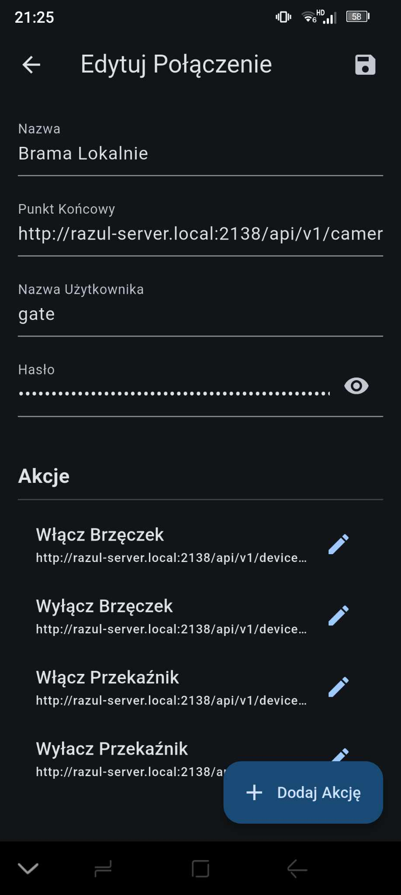
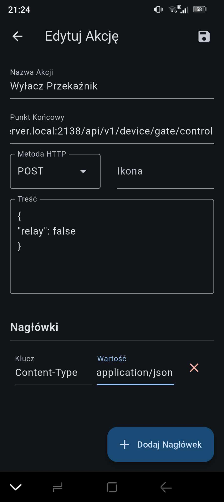

<!-- markdownlint-disable MD033 -->
# Gatecam

## Gatecam is a compact camera streaming solution featuring:

• A Go-based backend that handles frame capturing and streaming.  
• An ESP32 firmware for local camera frame receiving (grayscale or RGB565) and optional WiFi configuration.  
• A Flutter app that provides a responsive interface to view and manage streams, it also provides a simple way of interacting with the ESP32 firmware by using actions (basically http requests which can be easily managed).

## Features

• Real-time JPEG streaming and frame requests in color (RGB565) or grayscale.  
• Custom HTTP requests with optional headers and body data for interactions.  
• Docker and Makefile scripts for building and deploying the Go backend.  
• Straightforward UI to manage connections and their actions in the Flutter app.  

## Quick Start

1. Run the server in the “server” folder using Make (Docker optional).  
2. Flash the ESP32 firmware using platformio with correctly set up WiFi credentials and server IP.  
3. Open the Flutter app in “mobile/jpeg_stream_viewer” to manage and view streams.

## Configuration

- Check out [server/app/config.json](server/app/config.json) for a basic configuration example.
- Update WiFi credentials in the ESP32 code before flashing.

## Gallery

    
    
    
    

